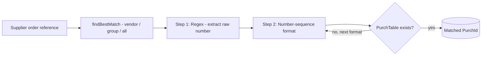

<!-- nav: Purchase-order recognition | id: einvoice-regex -->
# Purchase-order recognition (regex)

On an inbound purchase e-invoice the supplier rarely quotes a clean D365 purchase-order number. Smart Connect recovers it in **two steps**, both maintained from the processor's **Regex** button: first a *regex* extracts the raw number from the reference text, then a *number sequence* reshapes it into the real `PurchId` and validates it against open orders.

*Where to find it. On a DMS/Raptor processor, the Regex button in the toolbar opens the two steps — Purchase Id Regex (step 1) and Purchase Id formats (step 2).*

### Step 1 — Regex (extract the number)

The **Purchase Id Regex** table holds, per processor and per *Account type*, the pattern that pulls the raw PO number out of the supplier's reference. `NANExaPurchRegexTable::findBestMatch(vendor)` picks the most specific rule — *vendor → vendor group → all*.

| Field | Meaning |
| --- | --- |
| **Account type** | Scope of the rule: *Table* (one vendor), *Group* (a vendor group) or *All* vendors. |
| **Vendor relation** | The vendor account or vendor group the rule applies to (blank for *All*). |
| **Regex** | The pattern that extracts the PO number(s) from the reference text. |

*Step 1 — Regex. Example pattern PO\[- \]?(\\d{4,}) captures the digits after an optional “PO” (so PO-1234 or PO 1234 → 1234). Validate input tests it against sample text.*

`getPurchIdFromReference()` compiles the regex, runs it over the reference and iterates *every* match (`match.NextMatch()`); each captured candidate is passed to step 2.

### Step 2 — Number sequence (reshape & validate)

The **Purchase Id formats** table holds one or more *number-sequence formats* — the same masks D365 uses for number sequences, where `#` is a digit and `&` is a letter. `NANExaPurchFormatTable::validateReference()` takes each candidate from step 1 and, for every format in *Sort order*, rebuilds a full PurchId with `numInsertFormatInternal()`, then checks `PurchTable::exist()`. The first format that yields an *existing* purchase order wins.

| Field | Meaning |
| --- | --- |
| **Format** | A number-sequence mask (`#` = digit, `&` = letter), e.g. `PUR-######`. |
| **Sort order** | The order in which formats are tried; the first that resolves to a real PO is used. |

*Step 2 — Number sequence. Example mask PUR-###### turns the extracted 1234 into PUR-001234; if that PO exists it is accepted.*

### End to end

*Two-step purchase-order recognition — the most specific regex extracts the number, then each number-sequence format is tried until one resolves to a real purchase order.*

The UBL handler (`NANHandlerInDMSUblV2`) first tries the invoice's own *OrderReference* / *BuyerReference*, and only falls back to this two-step regex/format when there is no direct match.
