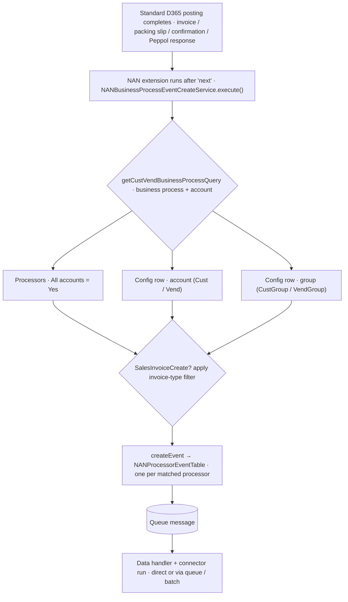

<!-- nav: Events & triggers | id: events-triggers -->
# Events & triggers — when a document fires, and to which processor

An **Event** processor (`Type = Event`) never polls. It is fired *synchronously*, inside the same transaction, right after a standard D365 posting completes. Two things decide whether anything happens: **which standard action ran** (the trigger) and **which processors are mapped** to that action for the document's customer or vendor (the routing).

### Out-of-the-box triggers

Each trigger is a thin extension on a standard posting class or table. After the standard code runs (`next …`), it builds a `NANBusinessProcessEventCreateContract` for the posted journal record and calls `NANBusinessProcessEventCreateService::execute()`, which resolves the matching processors and creates one event per processor. These are the business processes delivered in the box (the `NANBusinessProcess` enum is *extensible*, so partners can add their own):

| Business process (enum) | Fires after… | Hook (extension → method) | Source journal |
| --- | --- | --- | --- |
| **Sales order confirmation**
`SalesOrderConfirm` | Posting a sales order *confirmation* | `SalesConfirmJournalPost.postJournalPost()` | `CustConfirmJour` |
| **Packing slip**
`PackingSlipCreate` | Posting a *packing slip* | `SalesPackingSlipJournalPost.postJournalPost()` | `CustPackingSlipJour` |
| **Sales invoice**
`SalesInvoiceCreate` | Posting a *sales invoice / credit note* (proforma skipped) | `SalesInvoiceJournalPost.postJournalPost()` | `CustInvoiceJour` |
| **Free-text invoice**
`SalesInvoiceCreate` | Posting a *free-text invoice* (proforma skipped) | `CustPostInvoice.postCustInvoice()` | `CustInvoiceJour` |
| **Project invoice**
`SalesInvoiceCreate` | Posting a *project invoice* (proforma skipped) | `ProjInvoiceJournalPost.endPost()` | `ProjInvoiceJour` |
| **Purchase order confirmation**
`PurchOrderConfirm` | Posting a *purchase order confirmation* | `PurchConfirmationJournalPost.postJournalPost()` | `VendPurchOrderJour` |
| **Peppol response (MLR)**
`BusinessDocumentApplicationResponse` | An inbound Peppol *application response* is written and carries a processing code | `BusinessDocumentApplicationResponse.insert()` / `update()` | `CustInvoiceJour` (sales) or `VendInvoiceJour` (purchase) |

> **Info: Side effects on confirmation.**
>
> The two *confirmation* triggers also flip the extension flags on the order: after a sales confirmation, `NANSalesTable.Exported = Yes` and `ReExportOnConfirm = No`; after a purchase confirmation the same is set on `NANPurchTable`. That is what the *Exported* / *Re-export on confirm* fields on the order's *Integration* tab reflect.

### Manual (re)trigger — the “9A Smart Connect” button

Every posted-document journal form also gets a **9A Smart Connect** action-pane button (menu item `NANBusinessProcessEventCreateController`) that runs the *same* service against the selected record. Use it to (re)push a document through Smart Connect **without re-posting** it — e.g. after fixing a partner's routing, or when an export failed. The button is added to `CustInvoiceJournal`, `CustPackingSlipJournal`, `CustConfirmJournal`, `VendPurchOrderJournal` and `ProjInvoiceJournal`.

### Routing — “All accounts” vs. the Business process config table

Once a trigger fires, the service asks `NANBusinessProcessConfig::getCustVendBusinessProcessQuery()` for every processor that serves this business process *for this document's account*. There are two independent ways a processor gets selected:

| Mechanism | Where you set it | Fires for… | Best for |
| --- | --- | --- | --- |
| **All accounts**
`NANProcessorTable.IsAllAccounts = Yes` | The *All accounts* toggle in the processor's *Events* group (defaults to **Yes** on a new processor) | **Every** customer/vendor — no per-account setup needed | “Always export *every* sales invoice through this one processor.” |
| **Business process config**
`NANBusinessProcessConfig` | The *Business process config* setup form, or the *9A Smart Connect* button on a Customer / Vendor (pre-filtered to that account) | Only the accounts / groups you list: a row is *RelType* (Cust, Vend, CustGroup or VendGroup) + *RelationNum* (the account or group) → *ProcessorId* | “This partner (or customer group) needs a *different* processor / format.” |

> **Warning: The branches are unioned — they add up, they don't override.**
>
> The resolver builds a *union* of three branches, all filtered by the business process: *(1)* processors with *All accounts* = Yes, *(2)* processors linked to a config row for the exact **account**, and *(3)* processors linked to a config row for the customer/vendor **group**. A single posting can therefore fire *several* processors at once. If you want a specific partner handled by a dedicated processor, either turn its *All accounts* **off** and add a config row, or leave a general all-accounts processor running *alongside* the account-specific one.

### Invoice-type filtering (Sales invoice create only)

The *Invoice type selection* toggle and its *Invoice types* picker (`NANProcessorInvoiceTypeTable`) only matter for the `SalesInvoiceCreate` business process; the other triggers ignore them.

| *Invoice type selection* | What fires |
| --- | --- |
| **No** (default) | Every posted *sales* invoice / credit note that has a `SalesId` (backward-compatible behaviour). Free-text and project invoices do **not** fire in this mode (they have no `SalesId`). |
| **Yes** | Only the invoice types ticked in the picker: *Sales invoice / credit note*, *Free-text invoice / credit note*, *Project invoice / credit note*. This is the *only* way free-text and project invoices trigger an event. |

### What happens when it fires

For each matched processor the service calls `NANProcessorEventTable::createEvent()`, writing one event row (source table + record + document Id, Status = *Waiting*). From there the document follows the normal path: if the processor uses a queue it is enqueued and run by the retry engine / batch; an event with *Skip queue execution* (or no queue) runs the handler and connector immediately. See [Queue reference](queue-fields.md) and [Core concepts](../getting-started/key-concepts.md).

