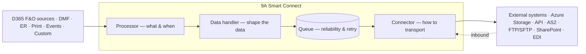

<!-- nav: How it works | id: architecture -->
# How it works

At a high level, Smart Connect sits between D365 F&O and your external systems. A trigger produces data, a processor orchestrates it through a data handler, an optional queue guarantees delivery, and a connector performs the actual transport.

*Figure 1 — High-level flow. Outbound reads left-to-right; inbound reverses through the same building blocks.*

### The four building blocks

| Block | Answers | Examples | Technical object |
| --- | --- | --- | --- |
| **Connector** | How do I connect to the external application? | Azure File share, REST API, SFTP, AS2, SharePoint | `NANConnecterTable` + `NANConnecter*` |
| **Processor** | What business process runs, in which direction, and how is it triggered? | “Export sales invoices”, “Import sales orders” | `NANProcessorTable` + `NANProcessor*` |
| **Data handler** | How is the data shaped / transformed? | DMF export, ER output, EDI, custom class | `NANHandler*` classes |
| **Queue** | How do I guarantee delivery and allow retries? | Pending / Processed / Error messages | `NANQueueTable` |

> **Info: Reusability by design**
>
> One connector can serve many processors, and one data handler can be re-used across processes. You compose integrations from these blocks instead of building each one from scratch.
