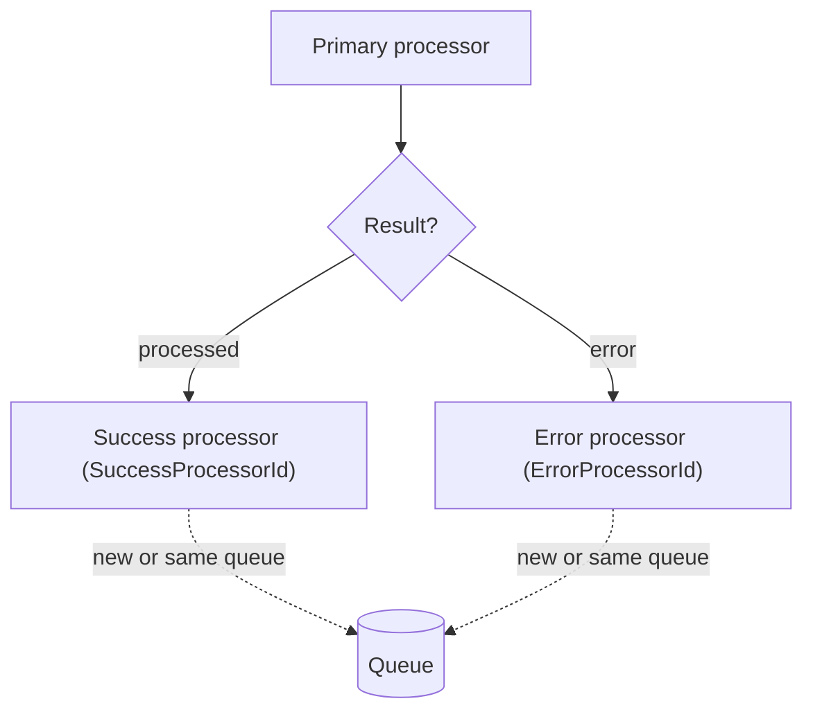

<!-- nav: Process chaining (successors) | id: successors -->
# Process chaining (successors)

A processor can automatically trigger another processor when it **succeeds** or **fails** — turning individual processes into an end-to-end workflow (for example: import → on success post to ERP → on failure notify).

### Configuration fields

| Field / parameter | Purpose |
| --- | --- |
| **Enable successor processor**
`NANParameterTable.EnableSuccessorProcessor` | Global master switch for successor logic. |
| **Success processor Id**
`NANProcessorTable.SuccessProcessorId` | The processor to run after successful completion. |
| **Error processor Id**
`NANProcessorTable.ErrorProcessorId` | The processor to run after a failure. |
| **Is successor processor**
`NANProcessorTable.IsSuccessorProcessor` | Marks a processor as eligible to be called as a successor (a validation guard). |
| **Detailed successor flow**
`NANProcessorTable.DetailedSuccessorProcessorFlow` | When *Yes*, a **new** queue record is created for the successor; when *No*, the same queue/payload is passed through. |
| **Business process = Parent processor** | For event-based parent/child hierarchies, the parent copies its event context to the child. |

### How it runs

On completion, `NANProcessor.processQueueProcessed()` calls `processSuccessorProcessor(SuccessProcessorId)`; on failure, `processQueueFailed()` calls it with the `ErrorProcessorId`. Depending on *Detailed successor flow*, the successor either reuses the original queue `RecId` or receives a fresh queue record created by `createQueueForDetailedSuccessorProcessorFlow()`. Execution is synchronous via `NANOrchestratorController`.

*Figure 12 — Success/error chaining. The successor inherits the payload (pass-through) or gets its own queue record (detailed flow).*

### How to configure

1.  **Enable** *Enable successor processor* in Parameters.
2.  **On the primary processor**, set *Success processor Id* and/or *Error processor Id*.
3.  **On each successor processor**, set *Is successor processor* = Yes.
4.  **Choose the flow**: leave *Detailed successor flow* = No to pass the same payload through, or set Yes to create an independent queue record (enables parallelism).
5.  **For parent/child events**, set the parent's *Business process* = *Parent processor*.
