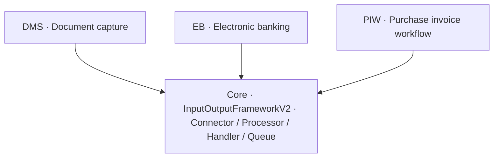

<!-- nav: Solution & module map | id: module-map -->
# Solution & module map

Smart Connect is delivered as a core model plus focused add-on models. Every object uses the `NAN` prefix (the legacy internal name of the framework was *Input Output Framework V2*).

| Model | Role | Highlights |
| --- | --- | --- |
| **InputOutputFrameworkV2**
`core` | The universal connector / processor / handler / queue engine. | All base classes, tables, forms, security, enums. |
| **InputOutputFrameworkV2 DMS** | Inbound document capture & management. | ExArte Raptor, UBL, Tungsten, MySupply handlers. |
| **InputOutputFrameworkV2 EB** | Electronic banking & payments. | Cobase connector, ISO 20022 PAIN/CAMT. |
| **InputOutputFrameworkV2 PIW** | Purchase invoice workflow. | Peppol e-invoice, Readsoft, UBL parsing, vendor sync. |
| **Pyladesinputoutputframework**
`legacy` | Earlier file-centric I/O framework. | Folder import/export; prefix `PYLIO`. |

*Figure 2 — Add-on models extend the core by contributing new data handlers and connectors.*
