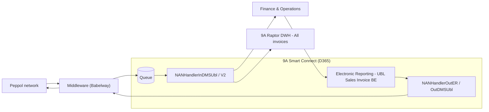
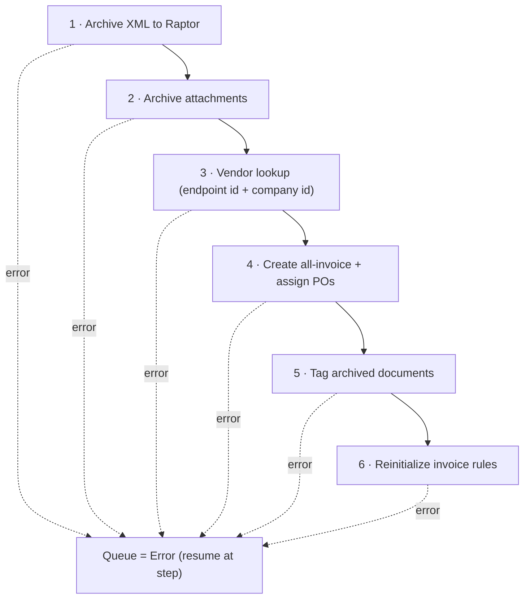

<!-- Generated from /docs by build/publish-wiki.mjs — edit there, not here. -->
# E-invoicing — Belgium (Peppol)

Belgian e-invoices are exchanged over the **Peppol** network through a certified **middleware** (Babelway in the reference implementation). The middleware talks to D365 through a Smart Connect API connector.



*Figure 8 — Belgian Peppol exchange. Inbound arrives via the middleware into the queue; outbound is generated by Electronic Reporting.*

#### Incoming

### Incoming e-invoices

The middleware receives the Peppol UBL and pushes it into the Smart Connect *queue*, where it is processed into a purchase invoice (the *All invoices* screen) and archived to Raptor.

#### Connector (middleware API)

**Connector — BABELWAY**

| Field | Value |
| --- | --- |
| Type | API |
| Authentication type | Basic |
| Client Id / Username | (from middleware) |
| Resource URL | https://eu1.babelway.net/rest/{user}/message |

#### Processor

-   **Data handler** = `NANHandlerInDMSUbl` (or `NANHandlerInDMSUblV2`)
-   **Use queue** = Yes · **Active** = Yes · **Type** = Event
-   **Queue forms** = `EXAPurchInvoiceImported`
-   **9A Raptor DWH** tab = optionally archive XML & PDF

The *processor name* must be communicated to the middleware, together with an **Entra ID** app registration (environment URL, client ID, tenant ID, secret) so the middleware can authenticate to D365.

> **Tip: Embedded PDF**
>
> Schedule a recurring batch to archive the embedded-PDF attachment of the e-invoice into Raptor. If a vendor does not include a PDF, the middleware can generate one from the Peppol content.

#### Outgoing

### Outgoing e-invoices

Outbound Belgian e-invoices are produced by **Electronic Reporting** and routed to the middleware through the *9A EDI* ER destination.

1.  **Connector** — reuse the middleware API connector from the incoming setup.
2.  **Processor** — data handler = `NANHandlerOutER` (standard) or `NANHandlerOutDMSUbl` (adds Raptor archiving of the generated e-invoice + embedded PDF and template tags). Use queue = Yes, Active = Yes.
3.  **Electronic Reporting** — import *UBL Sales Invoice BE* (and the *Invoice model mapping*) from the repository; register it in the AR parameters.
4.  **ER destination** — in the ER workspace, open *Electronic reporting destination* and set the *UBL Sales Invoice BE* output to the **9A EDI** destination (the processor).
5.  **Customer** — tick the *eInvoice* checkbox (and optionally *eInvoice attachment* for an embedded PDF).
6.  **Post** — post a sales invoice with *Print management* = Yes; the e-invoice is generated and sent. The *Sent electronically* column is marked on the invoice journal, and you follow up in the Queue.

> **Info: Raptor-generated embedded PDF**
>
> A dedicated ER variant (the “KS” embedded-PDF configuration, from the SmartConnect SharePoint) takes the PDF from Raptor instead of the invoice-journal attachment. When you use it, leave the customer's *eInvoice attachment* flag off.

#### V2 improvements

### What is new in V2 (`NANHandlerInDMSUblV2`)

V2 wraps V1 (no regression risk) and restructures inbound processing into resumable steps.

-   **Archive first** — the XML (and attachments) are archived to Raptor as the *first* step, linked to the queue record by its unique id. Documents are therefore reviewable in Raptor even if processing later fails. A processor parameter chooses *XML only*, *XML + attachments* or *attachments only*.
-   **Better vendor lookup** — vendors are matched on *both* the Peppol endpoint ID and the company ID, supporting **KBO, VAT and GLN** numbers (GLN via the *Global Location Number* on the registration-ID form). You can also set the vendor directly on the queue record and reprocess a “no vendor found” invoice without touching the XML.
-   **Split error flow** — processing is split into sub-processes with six defined stop points; reprocessing resumes at the point of failure, preventing duplicates. A *process-step* field on the queue tracks progress.
-   **PO-number regex** — purchase-order numbers in the XML can be transformed by regex: strip to the essential number, then map to predefined number formats (per vendor, vendor group, or all). Formats are tried by sort order until one matches a PO in `PurchTable`. Requires the newest Raptor (it stores the original XML value for validation).



*Figure 9 — The six-step, resumable V2 inbound process (NANHandlerInDMSUblV2).*

#### Middleware contract

### Middleware contract

The middleware transforms the received Peppol UBL and posts it to Smart Connect's inbound service. OAuth is used for authentication.

POST body → `NANProcessInService/setQueue`JSON

```
{
    "request": {
        "DataAreaId": "Company Code",
        "ProcessId": "Processor Name",
        "PayLoad": "[UBL]",
        "FileType": "XML",
        "FileName": "UBL_NAME.xml"
    }
}
```

**Flow:** `Peppol` → `Middleware` → `POST /api/services/NANProcessServiceGroup/NANProcessInService/setQueue` → `Queue`
