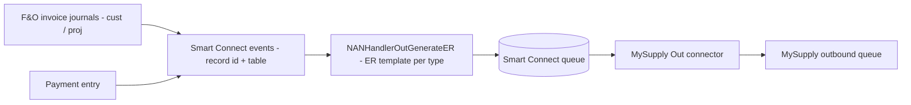
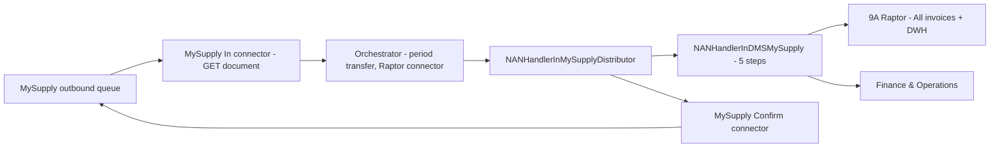

<!-- Generated from /docs by build/publish-wiki.mjs — edit there, not here. -->
# E-invoicing — France (MySupply)

The French solution integrates with the **MySupply** distributor (InExchange canonical format). It uses three dedicated connectors and archives everything to the 9A Raptor Document Warehouse.

[MySupplyDiagram.drawio — Open the original diagram in draw.io](attachments/MySupplyDiagram.drawio)

#### Outbound

E-invoice generation on posted journals — *Sales invoice*, *Sales credit note*, *Project invoice*, *Project credit note* — plus a *Confirm download* step.

#### Inbound

An *Orchestrator* (period transfer), an *E-invoice in* handler, and an *Archive document in* step to Raptor and F&O.

#### Connectors

*MySupply Out*, *MySupply In* and *MySupply Confirm* (API connectors).

### Outbound flow

Posting an invoice/credit note raises a Smart Connect **event**. The event is processed in batch by `NANHandlerOutGenerateER`, which runs an Electronic Reporting template (a different template per invoice type) to produce the MySupply UBL. The result is queued and delivered to the MySupply outbound queue.

*Figure 10 — MySupply outbound. Events fan-in to ER generation; each invoice type uses its own template.*

Trigger points are extensions on the posting classes (e.g. `SalesInvoiceJournalPost_NAN_Extension`, `ProjInvoiceJournalPost`) which call `NANBusinessProcessEventCreateService::execute()` to create the `NANProcessorEventTable` record. The generated document is archived to Raptor (target format linked to the invoice journal), and a separate **confirm-download** processor (`NANHandlerOutMySupplyDownloadConfirmation`) acknowledges receipt.

### Inbound flow

An **orchestrator** processor (a *period transfer* of type MySupply, using a connector of type Raptor) repeatedly fetches documents from the MySupply outbound queue until it is empty. Each document is handled by `NANHandlerInMySupplyDistributor`, which delegates to the DMS import handler, archives to Raptor and updates F&O, then confirms the download.

*Figure 11 — MySupply inbound. The orchestrator loops until the outbound queue is drained; each document is archived and confirmed.*

### The three MySupply connectors

| Connector | Direction | Purpose |
| --- | --- | --- |
| **MySupply Out** | out | Delivers the generated e-invoice (UBL) to MySupply. |
| **MySupply In** | in | Fetches inbound documents from the MySupply outbound queue (GET document). |
| **MySupply Confirm** | out | Confirms the download of a document so it is not fetched again. |

#### Inbound handler variables (`NANHandlerInMySupplyDistributor`)

`ProcessorEInvoice` `ProcessorStatusUpdate` `ProcessorArchival` `ProcessorDownloadConfirmator` `LogSummary` `ProcessOnlyOneDocument`

The distributor handler orchestrates sub-processors: the DMS e-invoice import, the status update, the Raptor archival and the download confirmation. The MySupply payload is a JSON contract (`NANMySupplyDistributorContract`: `base64File`, `fileName`, `id`); `NANMySupplyArchiveManager` and `NANBase64FileDetector` extract and type each document, and `NANXmlHelper_MySupply` navigates the InExchange namespaces.
