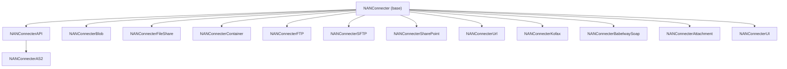
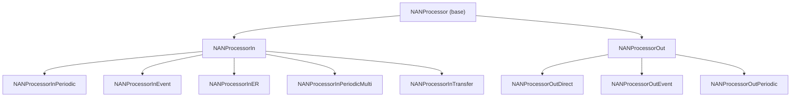

<!-- Generated from /docs by build/publish-wiki.mjs — edit there, not here. -->
# Class architecture

### Connector hierarchy

All connectors extend the base `NANConnecter`. Each concrete connector is decorated with `[NANConnecterAttribute(NANConnecterType::X)]`; the base uses `SysExtensionAppClassFactory::getClassFromSysAttribute()` to instantiate the correct subclass from configuration — no switch statements.

Key methods on the base class:

| Method | Responsibility |
| --- | --- |
| `construct()` / `constructInitAndPrimeForProcess()` | Factory that resolves, initialises and primes the right connector for a process. |
| `initialize()` | Set up telemetry and assign configuration values. |
| `prime()` | Connector-specific setup — login, token acquisition, client construction. |
| `execute(action, reference)` | Dispatch: routes a *Get* to `get()` and a *Post* to `set()`. |
| `get()` / `set()` | Download from / upload to the external source. |
| `getFileNames()` | List available files (file-capable connectors only). |
| `moveDelete()` | Move or delete a file after processing (success / failure folders). |

### Processor hierarchy

`NANProcessor` extends `SysOperationServiceBase`, so processors run in the standard batch/SysOperation framework.

### Handler hierarchy

Handlers shape the payload. The base is `NANHandler`, split into `NANHandlerIn` and `NANHandlerOut`. The naming convention encodes direction and purpose — e.g. `NANHandlerOutDmf`, `NANHandlerOutER`, `NANHandlerInDmf`, `NANHandlerOutEdiKrone`.

#### Representative outbound handlers

`NANHandlerOutDmf` `NANHandlerOutER` `NANHandlerOutEdi` `NANHandlerOutSalesInvoice` `NANHandlerOutAPI` `NANHandlerOutDR` `NANHandlerOutPaymentFile`

#### Representative inbound handlers

`NANHandlerInDmf` `NANHandlerInDmfJsonToXml` `NANHandlerInER` `NANHandlerInSalesXmlJson` `NANHandlerInTungstan`

### Orchestrator

Two orchestrators exist. `NANOrchestratorV2` is the current implementation and adds multithreading and queue-driven work dispatch; `NANOrchestrator` is retained for backward compatibility. The controller `NANOrchestratorController` is the *Run processors* menu action.
