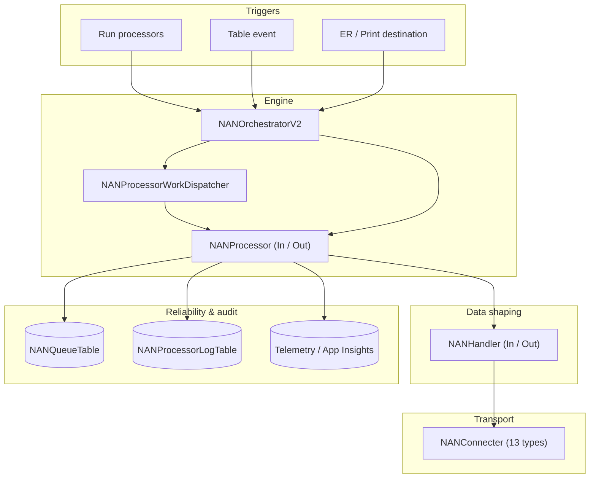

<!-- Generated from /docs by build/publish-wiki.mjs — edit there, not here. -->
# Component architecture

Internally the framework is layered. A trigger enters through the orchestrator, which schedules a processor; the processor drives a handler and a connector; the queue and logging provide reliability and observability.

