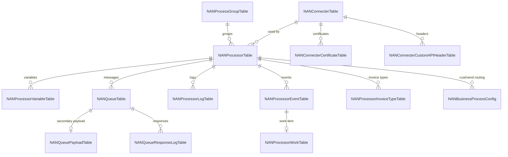

<!-- Generated from /docs by build/publish-wiki.mjs — edit there, not here. -->
# Data model

The core tables revolve around the connector and the processor. A connector is used by many processors; a processor owns its variables, events, queue messages and logs.

*Figure 7 — Core entity relationships.*

| Table | Purpose & key fields |
| --- | --- |
| `NANParameterTable` | Global settings: `EnableLogging`, `MaxRetries`, `EncryptCredentials`, `UseKeyvault`, `LogConnector`. |
| `NANConnecterTable` | Connector config: `ConnecterId`, `ConnecterType`, `AuthType`, `ResourceUrl`, credentials. |
| `NANProcessorTable` | Process definition: `ProcessId`, `HandlerId`, `ConnecterId`, `ProcessType`, `ProcessDirection`, `UseQueue`, `IsActive`. |
| `NANProcessorVariableTable` | Handler variables: `ProcessId`, `VarName`, `VarValue`. |
| `NANQueueTable` | Message queue: `QueueId`, `ProcessId`, `Status`, `Payload`, `RetryCount`, `RetryDateTime`. |
| `NANProcessorLogTable` | Execution log: `ProcessId`, `Reference`, `Payload`, `LogInfo`, `LogLevel`. |
| `NANProcessorEventTable` | Events: `ProcessId`, `RefTableId`, `RefRecId`, `EventType`, `Status`. |
| `NANProcessorWorkTable` | Parallel work items: `SourceType`, `SourceRecId`, `WorkStatus`, `RunId`, `RetryCount`. |
| `NANBusinessProcessConfig` | Cust/vend → processor routing: `RelType`, `RelationNum`, `ProcessorId`. |
