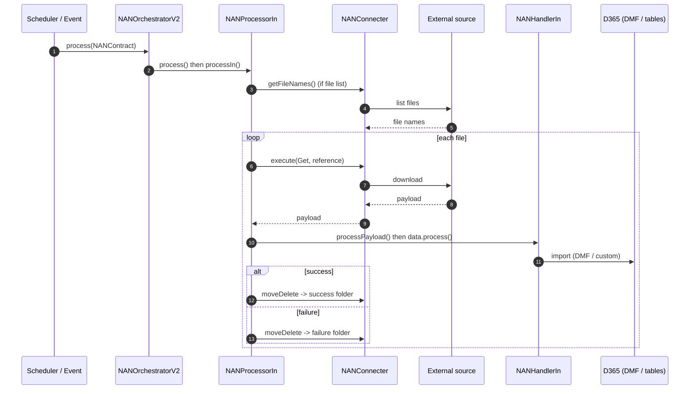

<!-- Generated from /docs by build/publish-wiki.mjs — edit there, not here. -->
# Inbound pipeline

The inbound (import) flow retrieves data from an external source and processes it into D365 F&O. For file-based connectors it can first list files and then process each one individually for per-file error handling.

*Figure 4 — Inbound sequence. Files can move to success/failure folders before or after processing (two-stage status).*

> **Info: File-list processing**
>
> With *Use file list*, the framework first obtains the list of files, then processes each file name separately. One bad file no longer blocks the rest of the batch.
