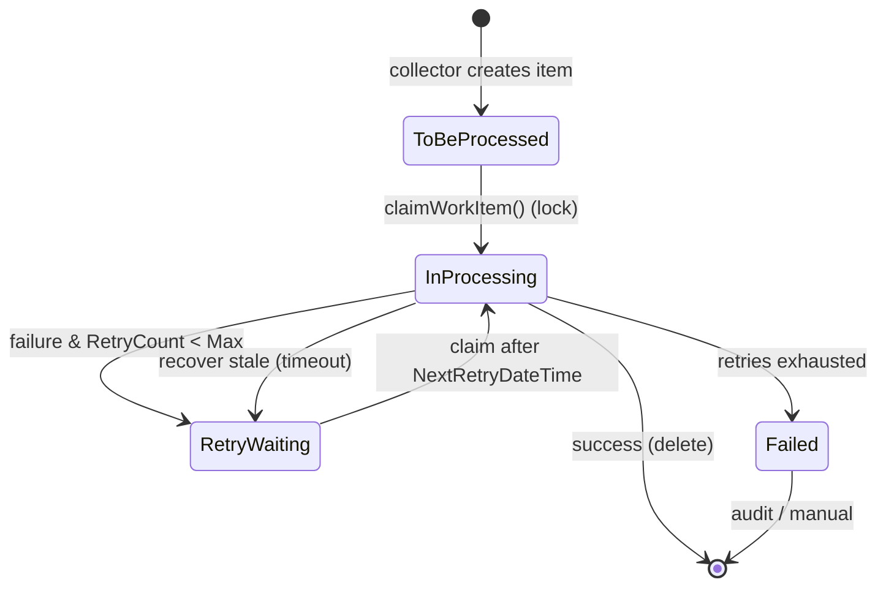

<!-- Generated from /docs by build/publish-wiki.mjs — edit there, not here. -->
# Multithreading & work dispatch

For event- and queue-driven processors, `NANOrchestratorV2` can process work in parallel using a work-dispatch subsystem. Items are collected from events and the queue into `NANProcessorWorkTable`, then claimed by worker threads.

| Class | Role |
| --- | --- |
| `NANProcessorWorkDispatcher` | Recovers stale items, collects new work, and spawns worker threads (capped at the item count). |
| `NANProcessorWorkItemCollector` | Creates work items from waiting events and pending queue records. |
| `NANProcessorWorkItemClaim` | Atomically claims the next item using a pessimistic lock with `READPAST`. |
| `NANProcessorWorkItemRecover` | Resets items stuck *InProcessing* beyond a timeout, and reassigns orphaned items. |
| `NANProcessorWorkExecutionService` | The worker loop that executes the processor for each claimed item. |

*Figure 6 — Work-item lifecycle (NANProcessorWorkStatus).*
