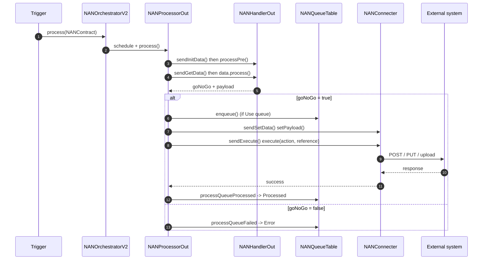

<!-- Generated from /docs by build/publish-wiki.mjs — edit there, not here. -->
# Outbound pipeline

The outbound (export) flow moves data from D365 F&O to an external system. The processor's `push()` loop is the heart of it.

*Figure 3 — Outbound sequence. The go/no-go flag decides whether the connector is called at all.*

### The go / no-go pattern

Inside `data.process()` the handler sets `goNoGo = true` only when there is genuinely data to export. If `false`, the connector is *not* called, avoiding empty sends. The term originates from aerospace “go / no-go” decisions.

### Filenames & folders

`NANHandlerOut.generateFileName()` derives the file name from the handler's reference plus a file extension; if *Unique filename* is enabled, `NANFunctions::getUniqueFilename()` appends a unique suffix to avoid collisions. Success/failure sub-folders are handled by the connector's `moveDelete()`.
