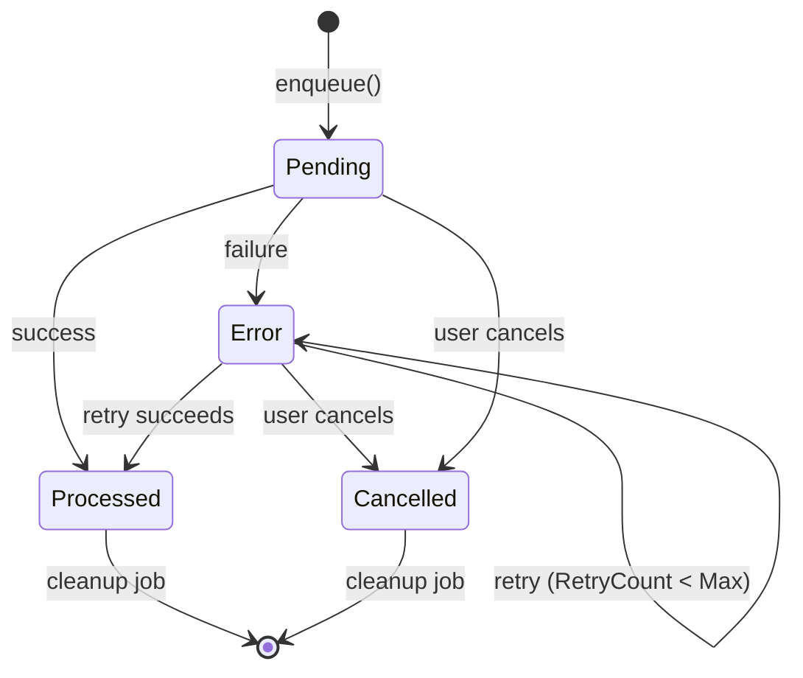

<!-- Generated from /docs by build/publish-wiki.mjs — edit there, not here. -->
# Queue & retry mechanics

When *Use queue* is enabled the processor runs in two passes: pass 1 collects and enqueues messages (`NANQueueTable::enqueue()`); pass 2 consumes the queue and performs the actual send/import, so failures can be retried without regenerating the payload.

*Figure 5 — Queue status lifecycle (NANQueueStatus).*

### Retry eligibility

A queued message is retried while `RetryCount < RetryMax` and its `RetryDateTime` has passed. When the maximum is reached the message stays in *Error* for inspection. Manual retries (from the Queue form) bypass the maximum.

### Response logging & successors

If the connector has *Enable response log*, the raw response is stored in `NANQueueResponseLogTable` (direct and deferred). A processor can also define success/error *successor* processors that automatically run when a message is processed or fails.

| Table | Holds |
| --- | --- |
| `NANQueueTable` | The message: payload, filename, status, retry count/time, references. |
| `NANQueuePayloadTable` | Secondary payload (e.g. an image alongside an XML). |
| `NANQueueResponseLogTable` | Direct/deferred responses for auditing and deferred processing. |
